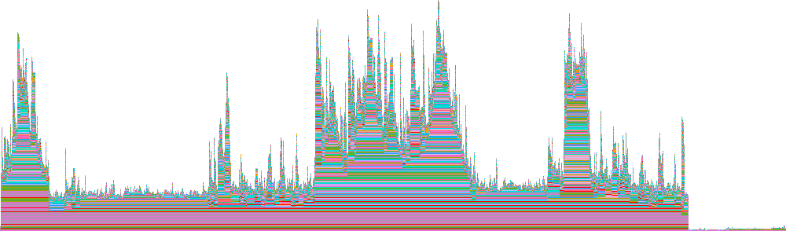
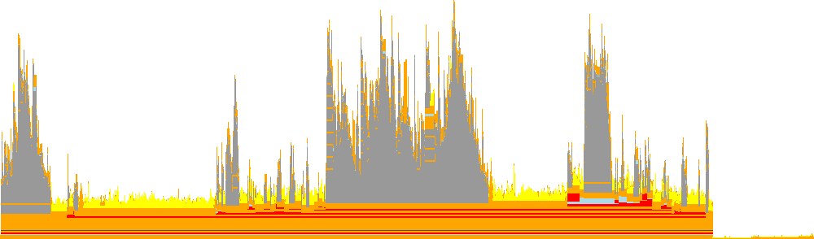

# FlameGraphs.jl

FlameGraphs is a package that adds functionality to Julia's `Profile` standard library. It is directed at the algorithmic side of producing [flame graphs](http://www.brendangregg.com/flamegraphs.html), but includes some "format agnostic" rendering code.
FlameGraphs is used by IDEs like [Juno](https://github.com/JunoLab/Juno.jl) and visualization packages like [ProfileView](https://github.com/timholy/ProfileView.jl), [ProfileVega](https://github.com/davidanthoff/ProfileVega.jl), and
[ProfileSVG](https://github.com/timholy/ProfileSVG.jl).

## Computing a flame graph

The core function of FlameGraphs is to compute a tree representation of a set of backtraces collected by Julia's [sampling profiler](https://docs.julialang.org/en/latest/manual/profile/). For a demonstration we'll use the following function:

```@repl profile_test
function profile_test(n)
    for i = 1:n
        A = randn(100,100,20)
        m = maximum(A)
        Am = mapslices(sum, A; dims=2)
        B = A[:,:,5]
        Bsort = mapslices(sort, B; dims=1)
        b = rand(100)
        C = B.*b
    end
end

profile_test(1)              # run once to compile

using Profile, FlameGraphs

Profile.clear(); @profile profile_test(10)    # collect profiling data

g = flamegraph()
```

This may not be very informative on its own; the only thing it communicates clearly is the number of samples (separate backtraces) collected during profiling, given by the range in the printed `NodeData`.
(If you run this example yourself, you might get a different number of samples depending on how fast your machine is and which operating system you use.)
It becomes more meaningful with

```@repl profile_test
using AbstractTrees

print_tree(g)
```

Each node of the tree consists of a `StackFrame` indicating the file, function, and line number of a particular entry in one or more backtraces, a status flag, and a range that corresponds to the horizontal span of a particular node when the graph is rendered.  See [`FlameGraphs.NodeData`](@ref) for more information.
(For developers, `g` is a
[left-child, right-sibling tree](https://github.com/JuliaCollections/LeftChildRightSiblingTrees.jl).)

[`flamegraph`](@ref) has several options that can be used to control how it computes the graph.

## Allocation profiles

FlameGraphs can also represent data collected by Julia's [allocation profiler](https://docs.julialang.org/en/v1/stdlib/Profile/#Profile.Allocs.@profile) (`Profile.Allocs`). Collect the data and pass the result of `Profile.Allocs.fetch()` to `flamegraph`:

```julia
using Profile, FlameGraphs

Profile.Allocs.@profile profile_test(10)

g = flamegraph(Profile.Allocs.fetch())
```

For an allocation flame graph, the width of each node measures memory allocation rather than run time: by default the number of bytes allocated, or the number of separate allocations with `mode=:count`. The leaf of each branch names the type of the allocated object. The resulting `g` is an ordinary flame graph and can be rendered exactly like a time profile.

## Rendering a flame graph

You can create a "bitmap" representation of the flame graph with [`flamepixels`](@ref):

```julia
julia> img = flamepixels(g)
125×20 Array{RGB{N0f8},2} with eltype ColorTypes.RGB{FixedPointNumbers.Normed{UInt8,8}}:
 RGB{N0f8}(1.0,0.0,0.0)  RGB{N0f8}(1.0,1.0,1.0)      …  RGB{N0f8}(1.0,1.0,1.0)  RGB{N0f8}(1.0,1.0,1.0)  RGB{N0f8}(1.0,1.0,1.0)
 RGB{N0f8}(1.0,0.0,0.0)  RGB{N0f8}(0.62,0.62,0.62)      RGB{N0f8}(1.0,1.0,1.0)  RGB{N0f8}(1.0,1.0,1.0)  RGB{N0f8}(1.0,1.0,1.0)
 RGB{N0f8}(1.0,0.0,0.0)  RGB{N0f8}(0.62,0.62,0.62)      RGB{N0f8}(1.0,1.0,1.0)  RGB{N0f8}(1.0,1.0,1.0)  RGB{N0f8}(1.0,1.0,1.0)
 RGB{N0f8}(1.0,0.0,0.0)  RGB{N0f8}(0.62,0.62,0.62)      RGB{N0f8}(1.0,1.0,1.0)  RGB{N0f8}(1.0,1.0,1.0)  RGB{N0f8}(1.0,1.0,1.0)
 RGB{N0f8}(1.0,0.0,0.0)  RGB{N0f8}(0.62,0.62,0.62)      RGB{N0f8}(1.0,1.0,1.0)  RGB{N0f8}(1.0,1.0,1.0)  RGB{N0f8}(1.0,1.0,1.0)
 RGB{N0f8}(1.0,0.0,0.0)  RGB{N0f8}(0.62,0.62,0.62)   …  RGB{N0f8}(1.0,1.0,1.0)  RGB{N0f8}(1.0,1.0,1.0)  RGB{N0f8}(1.0,1.0,1.0)
 RGB{N0f8}(1.0,0.0,0.0)  RGB{N0f8}(0.62,0.62,0.62)      RGB{N0f8}(1.0,1.0,1.0)  RGB{N0f8}(1.0,1.0,1.0)  RGB{N0f8}(1.0,1.0,1.0)
 RGB{N0f8}(1.0,0.0,0.0)  RGB{N0f8}(0.62,0.62,0.62)      RGB{N0f8}(1.0,1.0,1.0)  RGB{N0f8}(1.0,1.0,1.0)  RGB{N0f8}(1.0,1.0,1.0)
 RGB{N0f8}(1.0,0.0,0.0)  RGB{N0f8}(0.62,0.62,0.62)      RGB{N0f8}(1.0,1.0,1.0)  RGB{N0f8}(1.0,1.0,1.0)  RGB{N0f8}(1.0,1.0,1.0)
 RGB{N0f8}(1.0,0.0,0.0)  RGB{N0f8}(0.62,0.62,0.62)      RGB{N0f8}(1.0,1.0,1.0)  RGB{N0f8}(1.0,1.0,1.0)  RGB{N0f8}(1.0,1.0,1.0)
 ⋮                                                   ⋱                                                                        
 RGB{N0f8}(1.0,0.0,0.0)  RGB{N0f8}(0.62,0.62,0.62)   …  RGB{N0f8}(1.0,1.0,1.0)  RGB{N0f8}(1.0,1.0,1.0)  RGB{N0f8}(1.0,1.0,1.0)
 RGB{N0f8}(1.0,0.0,0.0)  RGB{N0f8}(1.0,1.0,1.0)         RGB{N0f8}(1.0,1.0,1.0)  RGB{N0f8}(1.0,1.0,1.0)  RGB{N0f8}(1.0,1.0,1.0)
 RGB{N0f8}(1.0,0.0,0.0)  RGB{N0f8}(1.0,1.0,1.0)         RGB{N0f8}(1.0,1.0,1.0)  RGB{N0f8}(1.0,1.0,1.0)  RGB{N0f8}(1.0,1.0,1.0)
 RGB{N0f8}(1.0,0.0,0.0)  RGB{N0f8}(1.0,1.0,1.0)         RGB{N0f8}(1.0,1.0,1.0)  RGB{N0f8}(1.0,1.0,1.0)  RGB{N0f8}(1.0,1.0,1.0)
 RGB{N0f8}(1.0,0.0,0.0)  RGB{N0f8}(1.0,1.0,1.0)         RGB{N0f8}(1.0,1.0,1.0)  RGB{N0f8}(1.0,1.0,1.0)  RGB{N0f8}(1.0,1.0,1.0)
 RGB{N0f8}(1.0,0.0,0.0)  RGB{N0f8}(0.659,0.635,0.0)  …  RGB{N0f8}(1.0,1.0,1.0)  RGB{N0f8}(1.0,1.0,1.0)  RGB{N0f8}(1.0,1.0,1.0)
 RGB{N0f8}(1.0,0.0,0.0)  RGB{N0f8}(1.0,1.0,1.0)         RGB{N0f8}(1.0,1.0,1.0)  RGB{N0f8}(1.0,1.0,1.0)  RGB{N0f8}(1.0,1.0,1.0)
 RGB{N0f8}(1.0,0.0,0.0)  RGB{N0f8}(1.0,1.0,1.0)         RGB{N0f8}(1.0,1.0,1.0)  RGB{N0f8}(1.0,1.0,1.0)  RGB{N0f8}(1.0,1.0,1.0)
 RGB{N0f8}(1.0,0.0,0.0)  RGB{N0f8}(0.804,0.725,1.0)     RGB{N0f8}(1.0,1.0,1.0)  RGB{N0f8}(1.0,1.0,1.0)  RGB{N0f8}(1.0,1.0,1.0)
 RGB{N0f8}(1.0,0.0,0.0)  RGB{N0f8}(0.804,0.725,1.0)     RGB{N0f8}(1.0,1.0,1.0)  RGB{N0f8}(1.0,1.0,1.0)  RGB{N0f8}(1.0,1.0,1.0)
```

You can display this in an image viewer, but for interactive exploration `ProfileView.jl` adds additional features.

The coloration scheme can be customized as described in the documentation for [`flamepixels`](@ref), with the default coloration provided by [`FlameColors`](@ref).
This default uses cycling colors to distinguish different stack frames, while coloring runtime dispatch red and garbage-collection orange.
If we profile "time to first plot,"

```
using Plots, Profile, FlameGraphs
@profile plot(rand(5))    # "time to first plot"
g = flamegraph(C=true)
```
```@setup ttfp
using FileIO, FlameGraphs, Colors, Profile

function profile_test(n)
    for i = 1:n
        A = randn(100,100,20)
        m = maximum(A)
        Am = mapslices(sum, A; dims=2)
        B = A[:,:,5]
        Bsort = mapslices(sort, B; dims=1)
        b = rand(100)
        C = B.*b
    end
end
profile_test(1)
Profile.clear()
@profile profile_test(10)
g = flamegraph(C=true)
save_image(name, img) = save(joinpath("assets", name), reverse(img'; dims=1))
```
```@repl ttfp
img = flamepixels(g);
save_image("ttfp.png", img) # hide
```
we might get something like this:



The following is an example of a customized coloration:
```@repl ttfp
fcolor = FlameColors(colorbg=colorant"#444", colorfont=colorant"azure",
                     colorsrt=colorant"lavender", colorsgc=nothing);
img = flamepixels(fcolor, g);
save_image("customized_ttfp.png", img) # hide
```


An alternative is to color frames by their category:

```@repl ttfp
img = flamepixels(StackFrameCategory(), g);
```
in which case we might get something like this:



In this plot, dark gray indicates time spent in `Core.Compiler` (mostly inference), yellow in [LLVM](https://en.wikipedia.org/wiki/LLVM), orange other `ccall`s, light blue in `Base`,
and red is uncategorized (mostly package code).

[`StackFrameCategory`](@ref) allows you to customize these choices and recognize arbitrary modules.
